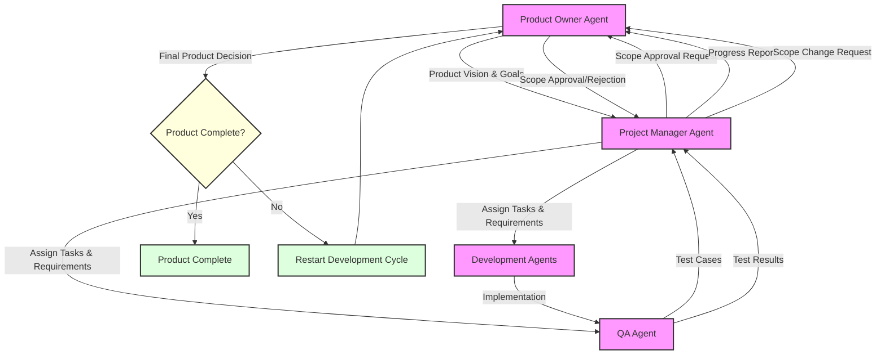

# Architecture

**Note:** The pipeline is triggered through GitHub's interface (issues or manual workflow dispatch). Users provide the website URL, which triggers the agent workflow starting with the PO agent.

**Testing Note:** Jest is used as the test runner for backend/agent and pipeline code. Tests are located in the `tests/` directory.

https://www.mermaidchart.com/app/projects/e023b0f6-1b86-4d3a-83b7-0c8fbed48de2/diagrams/fc8d4f5a-5959-47a7-b75a-dcc2fbd228b1/version/v0.1/edit

## Communication Flow Description

1. **Product Owner to Project Manager**

   - Initial product vision and goals
   - High-level requirements
   - Business objectives

2. **Project Manager to Product Owner**

   - Scope approval requests
   - Progress reports
   - Scope change requests

3. **Product Owner to Project Manager**

   - Scope approvals/rejections
   - Vision adjustments
   - Priority changes

4. **Project Manager to QA**

   - Task assignments
   - Requirements
   - Acceptance criteria

5. **Project Manager to Development**

   - Task assignments
   - Technical requirements
   - Implementation guidelines

6. **QA to Project Manager**

   - Test cases
   - Quality metrics
   - Test coverage reports

7. **Development to QA**

   - Implementation submissions
   - Code reviews
   - Technical documentation

8. **QA to Project Manager**

   - Test results
   - Quality reports
   - Defect reports

9. **Project Manager to Product Owner**

   - Progress reports
   - Risk assessments
   - Resource updates

10. **Project Manager to Product Owner**

    - Scope change requests
    - Timeline adjustments
    - Resource reallocation

11. **Product Owner Final Decision**
    - Product completion approval
    - Additional work requirements
    - Cycle restart decisions

- The pipeline is triggered through GitHub's interface (issues or manual workflow dispatch).
